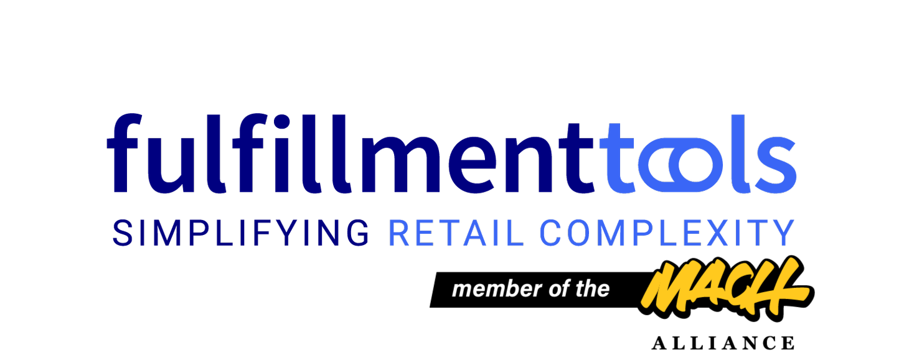

# fulfillmenttools TypeScript SDK

<p align="center">
  <a href="https://fulfillmenttools.com/">
    
  </a><br />
</p>

[](https://www.npmjs.com/package/@fulfillmenttools/fulfillmenttools-sdk-typescript)
[](https://github.com/fulfillmenttools/fulfillmenttools-sdk-typescript/releases)
[](https://github.com/fulfillmenttools/fulfillmenttools-sdk-typescript/actions/workflows/ci.yml)
[](./LICENSE)
[](./CODE_OF_CONDUCT.md)
[](./CONTRIBUTING.md)
[](https://www.typescriptlang.org/)

# 🤖 Introduction

This is a JavaScript/TypeScript SDK for the [fulfillmenttools REST API](https://docs.fulfillmenttools.com/api-docs/).

## 👉 Get started

The TypeScript SDK is fully open source and is available on [GitHub](https://github.com/fulfillmenttools/fulfillmenttools-sdk-typescript).
The package is published on [npmjs.com](https://www.npmjs.com/package/@fulfillmenttools/fulfillmenttools-sdk-typescript).
It contains both an ESM and a CommonJS build, so you can use it in the browser and in the backend.

```bash
$ npm install @fulfillmenttools/fulfillmenttools-sdk-typescript
```

Learn how to set up and use the TypeScript SDK with our [tutorial](./TUTORIAL.md).

## 📖 Documentation

The official fulfillmenttools API documentation can be found [here](https://docs.fulfillmenttools.com/api-docs/), and we also publish our [OpenAPI specification](https://fulfillmenttools.github.io/api-reference-ui/).

## 👨‍💻 Development

### 👉 Requirements

- [Node.js](https://nodejs.org/en/) 20 with [NVM](https://github.com/nvm-sh/nvm) and npm

### 🛫 Setup

```bash
$ nvm use
```

### 🤸 Building

```bash
$ npm install
$ npm run build
```

### 🕵️ Running unit tests

When running unit tests the `.env.local` file will be used with dummy settings.

```bash
$ npm run test
```

### 🕵️‍♀️ Linting

```bash
$ npm run lint
```

## 📜 License

All code in this repository is licensed under the [MIT license](https://github.com/fulfillmenttools/fulfillmenttools-sdk-typescript/blob/master/LICENSE).

## 🙌 Contributing

We'd love to have your helping hand on this ecosystem! Please see [CONTRIBUTING.md](./CONTRIBUTING.md) for more information on our guidelines.

## :blue_heart: Thanks

Thanks for all your contributions and efforts towards improving the fulfillmenttools TypeScript SDK. We thank you for being part of our :sparkles: community :sparkles:!
